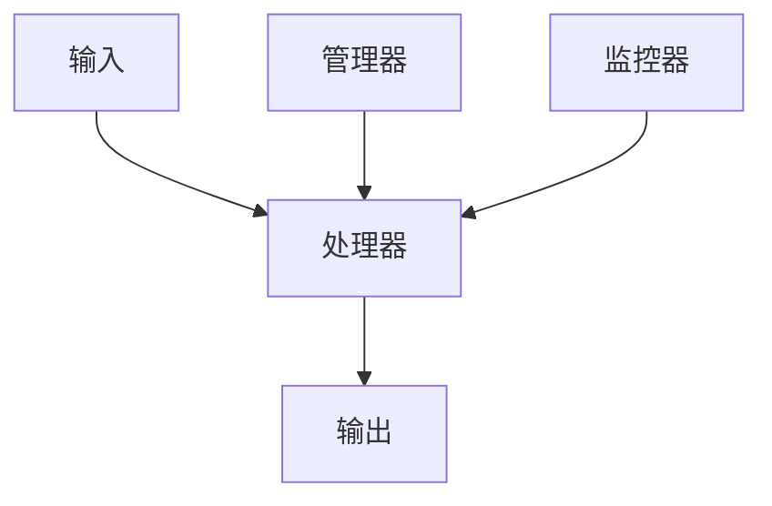

# Design 文档规范

## 必须遵守的规范

- 注意 degin.md 文件结构，遵循下面的文档结构规范。
- 注意依赖关系

## 文档结构规范

对spec任务进行仔细分析，根据需求文档 requirements.md，来生成设计文档 design.md

### 1. 文档标题
- **格式**: `# {项目名称}设计文档`
- **要求**: 标题应清晰描述项目或功能模块
- **示例**: `# CSS样式修复设计文档`

### 2. 概述部分
- **格式**: `## 概述`
- **内容**: 简要描述设计目标、技术方案和预期效果
- **要求**: 清晰说明要解决的问题和解决方案的核心理念

### 3. 架构部分
- **格式**: `## 架构`
- **结构**: 包含整体架构图、核心组件关系图、分层架构等
- **要求**: 使用图表或文字描述系统架构和组件关系

#### 3.1 整体架构
- 使用流程图、架构图或文字描述系统整体结构
- 展示数据流和组件交互关系

#### 3.2 核心组件
- 列出系统的主要组件及其职责
- 使用树状结构或列表展示组件层次关系

#### 3.3 分层架构
- 描述系统的分层设计（如：解析层、转换层、应用层等）
- 明确各层的职责和依赖关系

### 4. 组件和接口部分
- **格式**: `## 组件和接口`
- **结构**: 详细描述每个核心组件的接口设计
- **要求**: 包含类定义、方法签名和职责说明

#### 4.1 组件接口设计
- 使用代码块展示类定义和接口
- 包含方法签名、参数说明和返回值
- 使用注释说明每个方法的职责

#### 4.2 数据流设计
- 描述组件之间的数据交互
- 说明输入输出和数据处理流程

## 内容规范

### 1. 架构图规范
- 使用 Mermaid 语法或 ASCII 图表
- 图表应清晰展示组件关系和数据流
- 包含必要的图例和说明

### 2. 接口设计规范
- 使用 Python 伪代码展示接口设计
- 包含完整的类定义和方法签名
- 使用类型提示和文档字符串

### 3. 技术术语
- 首次出现的专业术语应在概述中定义
- 保持术语在整个文档中的一致性
- 使用行业标准术语

### 4. 格式规范
- 使用 Markdown 格式
- 标题层级清晰（# → ## → ###）
- 代码块使用正确的语法高亮
- 图表使用合适的格式

## 质量要求

### 1. 技术可行性
- 设计方案应在技术上是可行的
- 考虑现有技术栈和框架限制
- 提供替代方案或降级策略

### 2. 架构清晰性
- 架构设计应易于理解和实现
- 组件职责明确，避免功能重叠
- 依赖关系合理，避免循环依赖

### 3. 接口完整性
- 接口设计应覆盖所有主要功能
- 方法签名应完整且语义清晰
- 考虑错误处理和边界情况

### 4. 可扩展性
- 设计方案应考虑未来扩展需求
- 使用设计模式和模块化设计
- 预留接口和扩展点

## 示例结构

```markdown
# {项目名称}设计文档

## 概述
{项目背景、设计目标和解决方案概述}

## 架构

### 整体架构
```
{架构图或流程图}
```

### 核心组件
```
{组件层次结构图}
```

### 分层架构
{分层架构描述}

## 组件和接口

### {组件1名称}
```python
class {组件1类名}:
    """{组件职责说明}"""
    
    def {方法1}(self, {参数}):
        """{方法说明}"""
        pass
    
    def {方法2}(self, {参数}):
        """{方法说明}"""
        pass
```

### {组件2名称}
```python
class {组件2类名}:
    """{组件职责说明}"""
    
    def {方法1}(self, {参数}):
        """{方法说明}"""
        pass
```
```

## 架构设计模式

### 常用设计模式
1. **分层架构**: 将系统分为多个层次，各层职责明确
2. **组件化设计**: 将功能拆分为独立的可复用组件
3. **适配器模式**: 为不同接口提供统一的适配层
4. **工厂模式**: 统一创建和管理对象实例
5. **观察者模式**: 实现数据变化时的自动通知机制

### 架构原则
1. **单一职责原则**: 每个组件只负责一个明确的功能
2. **开闭原则**: 对扩展开放，对修改关闭
3. **依赖倒置原则**: 依赖抽象而非具体实现
4. **接口隔离原则**: 使用专门的接口而非通用接口

## 注意事项

1. **避免过度设计**: 设计方案应简洁实用，避免不必要的复杂性
2. **考虑性能影响**: 评估设计方案对系统性能的影响
3. **提供实现路径**: 设计方案应包含具体的实现步骤
4. **考虑兼容性**: 确保设计方案与现有系统兼容
5. **包含测试策略**: 设计方案应考虑如何验证实现的正确性

## 图表规范

### Mermaid 图表示例


### ASCII 图表示例
```
┌─────────────────┐    ┌──────────────────┐    ┌─────────────────┐
│   组件A         │───▶│    组件B         │───▶│    组件C        │
│                 │    │                  │    │                 │
│ - 功能1         │    │ - 功能2          │    │ - 功能3         │
│ - 功能2         │    │ - 功能3          │    │ - 功能4         │
└─────────────────┘    └──────────────────┘    └─────────────────┘
```